# Design Document: AI 조별과제 PM 에이전트

## Overview

AI 조별과제 PM 에이전트는 대학생 조별과제를 AI가 자율적으로 관리하는 웹 애플리케이션이다. 팀원은 팀 정보 입력, 채팅 및 결과물 제출, AI 제안 수락/거절 3가지만 수행하며, 나머지 프로젝트 관리 업무(역할 분배, 일정 관리, 품질 리뷰, 지연 감지, 재배분, 보고서 취합, PPT 생성)는 AI PM 에이전트가 자율적으로 수행한다.

모든 AI 판단은 Amazon Bedrock Claude API 호출을 통해 이루어지며, 하드코딩된 분기 로직을 사용하지 않는다. 프로젝트 종료 후에는 완성된 과제를 마켓플레이스에 등록하여 수익화할 수 있다. 활동 포인트(Commitment Point) 시스템을 통해 팀플 참여 보증금을 걸고, AI가 활동량을 분석하여 포인트를 정산하며, 무임승차를 억제한다.

### 핵심 설계 원칙

- **AI 자율 판단**: 모든 판단은 Bedrock Claude API 호출로 수행하며, if-else 하드코딩 분기를 사용하지 않는다
- **단일 호출 연쇄 처리**: 결과물 리뷰 시 품질 평가 → 진행률 산정 → 지연 감지 → 재배분 제안을 단일 Bedrock 호출로 처리한다
- **협상 루프**: AI 제안 거절 시 최대 3회까지 대안을 생성하며, 이전 이력을 참조하여 반복을 방지한다
- **AI 3단계 자율 사고**: 포인트 시스템에서 "예측 → 행동 → 평가"를 AI가 자율적으로 수행한다 (모두 Bedrock 호출)
- **해커톤 MVP**: localStorage 기반 영속성, 웹소켓 없이 React State + POST 호출 방식으로 채팅 구현

### 기술 스택

| 레이어 | 기술 | 비고 |
|--------|------|------|
| 프론트엔드 | React 18 + TypeScript + Tailwind CSS | Vite 빌드 |
| 백엔드 | AWS Lambda (Node.js 20) | API Gateway REST |
| AI | Amazon Bedrock Claude 3.5 Sonnet | JSON 출력 전용 |
| 배포 | AWS Amplify (프론트) + Lambda (API) | |
| 상태관리 | React Context + useReducer | 전역 상태 |
| 영속성 | localStorage | DB 사용하지 않음 (해커톤 MVP) |
| PPT | reveal.js (CDN) | HTML 프레젠테이션 |


## Architecture

### High-Level Architecture

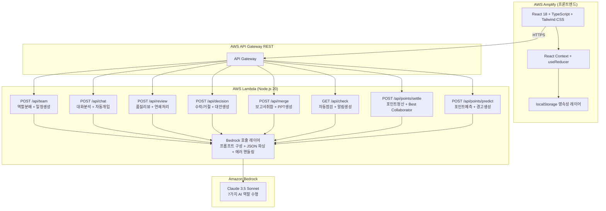

### 핵심 데이터 흐름

#### 데이터 영속성 흐름 (React Context + localStorage 전용)

모든 데이터는 React Context + useReducer로 전역 관리되며, DB 없이 localStorage만 사용한다. Context 상태가 변경될 때마다 localStorage에 자동 동기화되고, 앱 로드 시 localStorage에서 자동 복원된다.

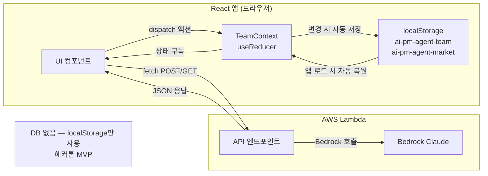

#### 팀 생성 흐름

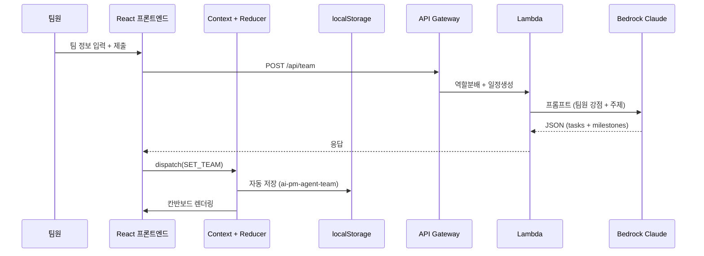

#### 채팅방 흐름 (웹소켓 없이 React State + POST 호출)

채팅방은 웹소켓을 사용하지 않는다. 팀원이 메시지를 전송하면 React State에 즉시 추가하고, POST /api/chat을 호출하여 AI 분석 결과를 받아 다시 State에 반영한다. 모든 채팅 데이터는 Context를 통해 localStorage에 자동 저장된다.

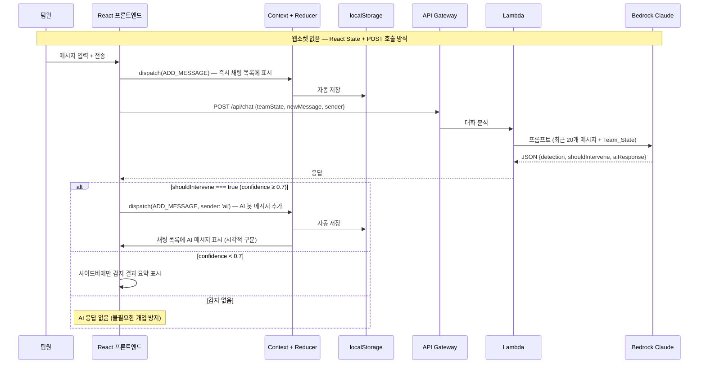

### 연쇄 실행 아키텍처

시스템의 핵심은 3가지 연쇄 실행 패턴이다:

1. **결과물 제출 연쇄** (POST /api/review): 품질 리뷰 → 진행률 산정 → 지연 감지 → 재배분 제안을 단일 Bedrock 호출로 처리
2. **보고서 연쇄** (POST /api/merge): 전원 완료 감지 → 보고서 병합 → PPT 생성
3. **협상 루프** (POST /api/decision): 제안 → 수락/거절 → 대안 생성 (최대 3회)
4. **포인트 정산 연쇄** (POST /api/points/settle): 프로젝트 종료 → 활동 데이터 분석 → 기여도 산출 → 포인트 정산 → Best Collaborator 선정
5. **포인트 예측 연쇄** (POST /api/points/predict): AI 자율 판단 → 포인트 변동 예측 → 경고/동기부여 메시지 생성

#### 결과물 제출 4단계 연쇄 상세 흐름

팀원이 결과물 텍스트를 제출하면, 단일 POST /api/review 호출 내에서 Lambda가 하나의 Bedrock 프롬프트로 4단계를 순차 실행한다. 각 단계의 출력이 다음 단계의 입력으로 사용되며, 팀원의 추가 조작 없이 전부 자동으로 처리된다.

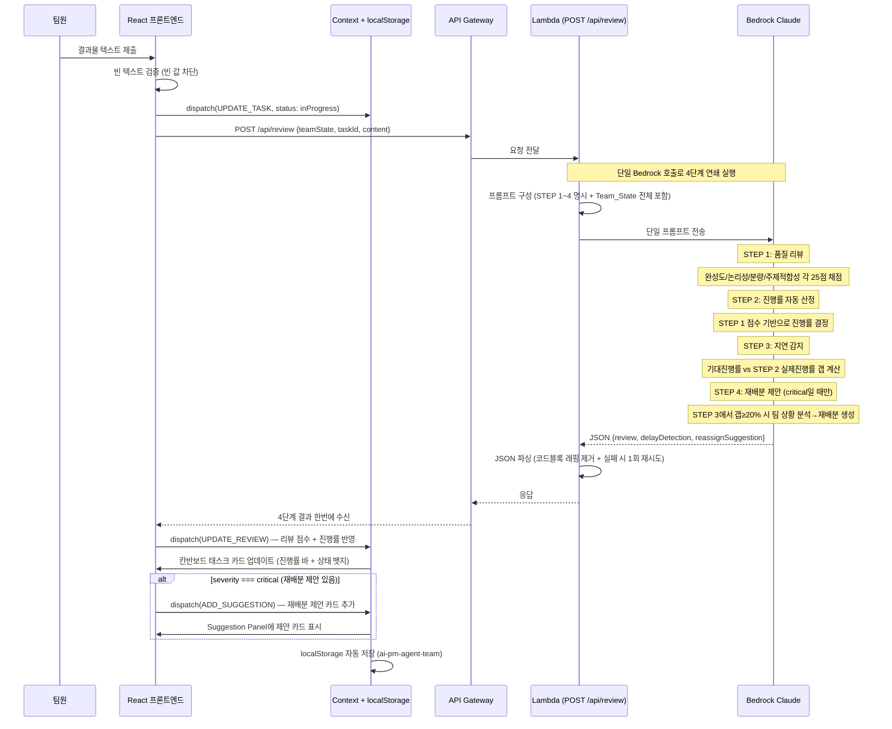

#### 보고서 취합 + PPT 연쇄 흐름

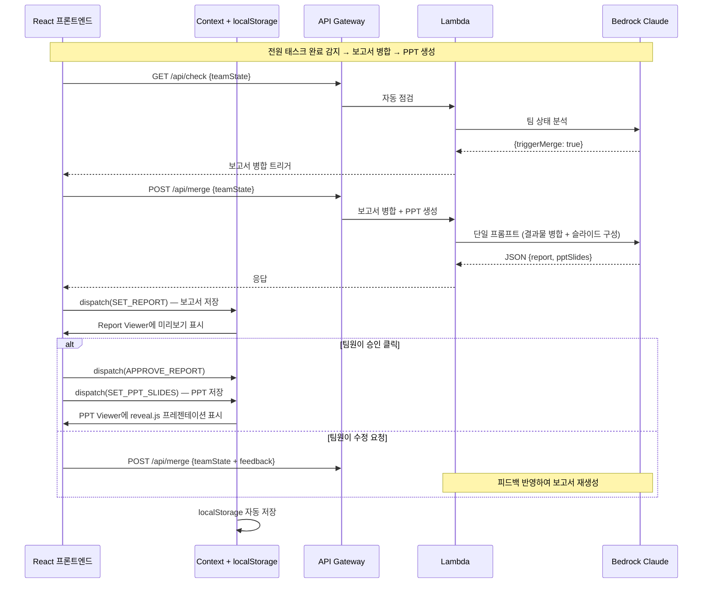

#### 자율 협상 루프 흐름

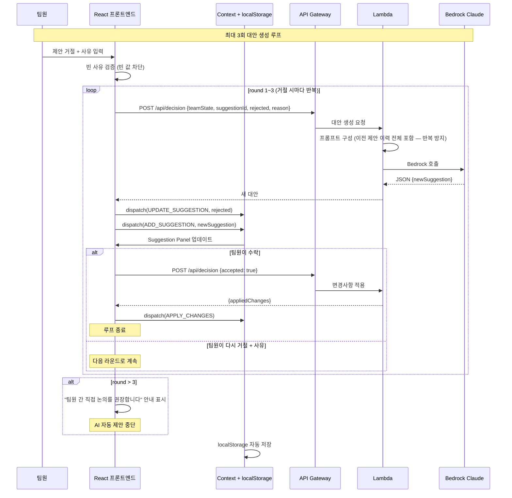

#### 포인트 정산 흐름 (POST /api/points/settle)

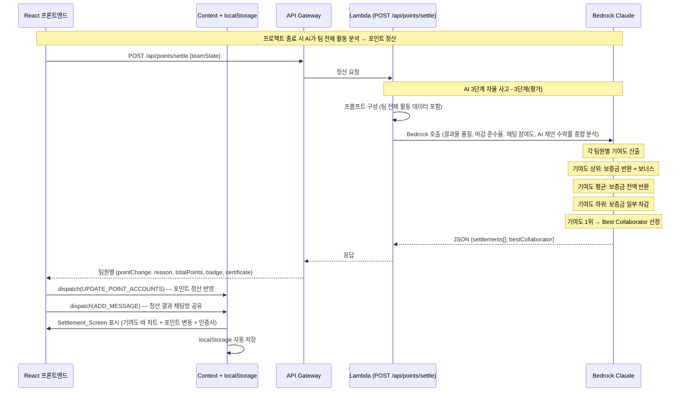

#### AI 실시간 포인트 예측 흐름 (POST /api/points/predict)

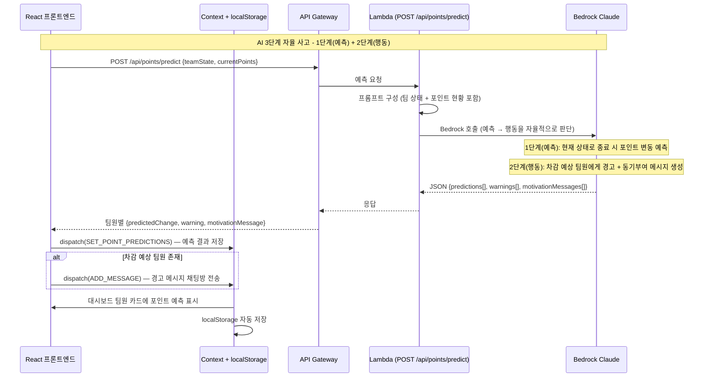

#### 포인트 획득/차감 이벤트 흐름

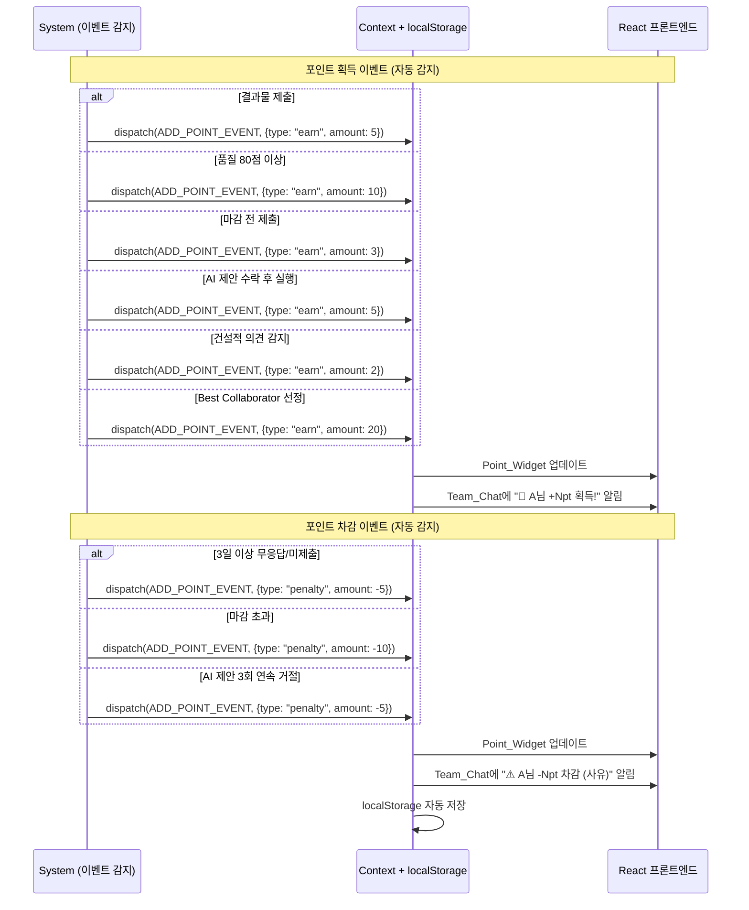


## Components and Interfaces

### 프론트엔드 컴포넌트 구조

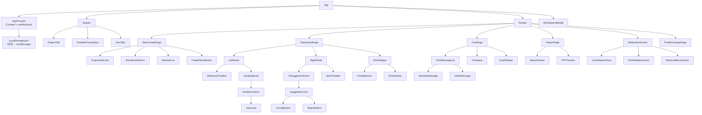

### 파일 구조

```
src/
├── components/
│   ├── team/                    # 팀 생성 관련
│   │   ├── TeamCreatePage.tsx   # 팀 생성 페이지
│   │   ├── ProjectInfoForm.tsx  # 프로젝트 정보 입력 폼
│   │   ├── MemberAddForm.tsx    # 팀원 추가 폼
│   │   └── MemberList.tsx       # 추가된 팀원 목록
│   ├── dashboard/               # 대시보드 + 칸반보드
│   │   ├── DashboardPage.tsx    # 대시보드 메인 페이지
│   │   ├── KanbanBoard.tsx      # 칸반 보드
│   │   ├── KanbanColumn.tsx     # 칸반 컬럼 (Todo/InProgress/Done)
│   │   ├── TaskCard.tsx         # 태스크 카드
│   │   ├── MilestoneTimeline.tsx # 마일스톤 타임라인
│   │   └── AlertTimeline.tsx    # 알림 타임라인
│   ├── chat/                    # 채팅방
│   │   ├── ChatPage.tsx         # 채팅 페이지
│   │   ├── ChatMessageList.tsx  # 메시지 목록
│   │   ├── ChatInput.tsx        # 메시지 입력
│   │   └── ChatSidebar.tsx      # 감지 항목 사이드바
│   ├── review/                  # 결과물 제출 + 리뷰
│   │   ├── WorkSubmitModal.tsx  # 결과물 제출 모달
│   │   └── ReviewResult.tsx     # AI 리뷰 결과 표시
│   ├── suggestion/              # AI 제안 패널
│   │   ├── AISuggestionPanel.tsx # 제안 패널
│   │   ├── SuggestionCard.tsx   # 제안 카드
│   │   └── SuggestionHistory.tsx # 제안 이력
│   ├── report/                  # 보고서 + PPT
│   │   ├── ReportPage.tsx       # 보고서 페이지
│   │   ├── ReportViewer.tsx     # 보고서 뷰어
│   │   └── PPTPreview.tsx       # PPT 미리보기
│   ├── marketplace/             # 마켓플레이스
│   │   ├── MarketplacePage.tsx  # 마켓 메인 페이지
│   │   └── MarketListingCard.tsx # 과제 카드
│   ├── points/                  # 포인트 시스템
│   │   ├── PointWidget.tsx      # 대시보드 포인트 위젯 (잔액, 보증금, 최근 변동)
│   │   ├── SettlementScreen.tsx # 프로젝트 종료 정산 화면
│   │   ├── ContributionChart.tsx # 기여도 바 차트
│   │   ├── BestCollaboratorCert.tsx # Best Collaborator 인증서
│   │   └── PointExchangePage.tsx # 포인트 교환 페이지
│   └── common/                  # 공통 컴포넌트
│       ├── LoadingOverlay.tsx   # 로딩 오버레이
│       ├── ErrorMessage.tsx     # 에러 메시지
│       └── Header.tsx           # 헤더
├── context/
│   ├── TeamContext.tsx           # React Context 정의
│   └── teamReducer.ts           # useReducer 액션/리듀서
├── hooks/
│   ├── useTeam.ts               # 팀 상태 관리 훅
│   ├── useChat.ts               # 채팅 로직 훅
│   ├── useAISuggestion.ts       # AI 제안 관리 훅
│   ├── usePoints.ts             # 포인트 시스템 관리 훅
│   └── useLocalStorage.ts       # localStorage 동기화 훅
├── types/
│   └── index.ts                 # TypeScript 인터페이스 정의
├── api/
│   ├── teamApi.ts               # POST /api/team
│   ├── chatApi.ts               # POST /api/chat
│   ├── reviewApi.ts             # POST /api/review
│   ├── decisionApi.ts           # POST /api/decision
│   ├── mergeApi.ts              # POST /api/merge
│   ├── checkApi.ts              # GET /api/check
│   ├── pointsSettleApi.ts       # POST /api/points/settle
│   └── pointsPredictApi.ts      # POST /api/points/predict
├── utils/
│   ├── pptGenerator.ts          # reveal.js HTML 생성
│   ├── dateUtils.ts             # 날짜 유틸리티
│   └── jsonParser.ts            # JSON 파싱 + 코드블록 제거
└── App.tsx
```

### 커스텀 훅 인터페이스

```typescript
// useTeam - 팀 상태 관리
function useTeam(): {
  team: Team | null;
  loading: boolean;
  error: string | null;
  createTeam: (input: TeamCreateInput) => Promise<void>;
  updateTaskProgress: (taskId: string, progress: number) => void;
  applyChanges: (changes: AppliedChange[]) => void;
};

// useChat - 채팅 로직
function useChat(): {
  messages: ChatMessage[];
  detections: AiDetection[];
  sending: boolean;
  sendMessage: (content: string, senderId: string) => Promise<void>;
};

// useAISuggestion - AI 제안 관리
function useAISuggestion(): {
  suggestions: AISuggestion[];
  processing: boolean;
  acceptSuggestion: (suggestionId: string) => Promise<void>;
  rejectSuggestion: (suggestionId: string, reason: string) => Promise<void>;
};

// useLocalStorage - localStorage 동기화
function useLocalStorage<T>(key: string, initialValue: T): [T, (value: T) => void];

// usePoints - 포인트 시스템 관리
function usePoints(): {
  pointAccounts: PointAccount[];
  predictions: PointPrediction[];
  settlementResult: SettlementResult | null;
  loading: boolean;
  initializePoints: (members: Member[]) => void;
  depositPoints: (memberId: string, amount: number) => void;
  addPointEvent: (memberId: string, type: PointHistoryType, amount: number, reason: string) => void;
  settlePoints: (teamState: Team) => Promise<void>;
  predictPoints: (teamState: Team) => Promise<void>;
  exchangePoints: (memberId: string, item: ExchangeItem) => boolean;
};
```

### API 호출 함수 인터페이스

```typescript
// api/teamApi.ts
async function createTeam(input: {
  projectName: string;
  topic: string;
  deadline: string;
  members: MemberInput[];
}): Promise<{
  tasks: Task[];
  milestones: Milestone[];
  aiMessage: string;
}>;

// api/chatApi.ts
async function analyzeChat(input: {
  teamState: Team;
  newMessage: string;
  sender: string;
}): Promise<{
  detection: { type: string; confidence: number; detail: string };
  shouldIntervene: boolean;
  aiResponse: string;
  suggestedActions: SuggestedAction[];
}>;

// api/reviewApi.ts
async function submitReview(input: {
  teamState: Team;
  taskId: string;
  submittedContent: string;
}): Promise<{
  review: Review;
  delayDetection: DelayDetection;
  reassignSuggestion: AISuggestion | null;
}>;

// api/decisionApi.ts
async function processDecision(input: {
  teamState: Team;
  suggestionId: string;
  accepted: boolean;
  rejectionReason?: string;
}): Promise<{
  action: 'apply' | 'newSuggestion';
  appliedChanges?: AppliedChange[];
  newSuggestion?: AISuggestion;
}>;

// api/mergeApi.ts
async function mergeReport(input: {
  teamState: Team;
}): Promise<{
  report: Report;
  pptSlides: PPTSlide[];
}>;

// api/checkApi.ts
async function runCheck(input: {
  teamState: Team;
}): Promise<{
  alerts: Alert[];
  triggerMerge: boolean;
  aiChatMessage: string;
}>;

// api/pointsSettleApi.ts
async function settlePoints(input: {
  teamState: Team;
  pointAccounts: PointAccount[];
}): Promise<{
  settlements: {
    memberId: string;
    pointChange: number;
    reason: string;
    totalPoints: number;
    badge: string | null;
    certificate: PointCertificate | null;
  }[];
  bestCollaborator: {
    memberId: string;
    memberName: string;
    certificate: PointCertificate;
  };
  aiComment: string;
}>;

// api/pointsPredictApi.ts
async function predictPoints(input: {
  teamState: Team;
  pointAccounts: PointAccount[];
}): Promise<{
  predictions: {
    memberId: string;
    predictedChange: number;
    warning: string | null;
    motivationMessage: string;
  }[];
}>;
```

### Lambda 함수 구조

각 Lambda 함수는 동일한 패턴을 따른다:

```typescript
// Lambda 핸들러 공통 패턴
export const handler = async (event: APIGatewayProxyEvent): Promise<APIGatewayProxyResult> => {
  try {
    const body = JSON.parse(event.body || '{}');
    
    // 1. 프롬프트 구성 (팀 전체 상태 포함)
    const prompt = buildPrompt(body);
    
    // 2. Bedrock Claude 호출
    const aiResponse = await invokeBedrock(prompt);
    
    // 3. JSON 파싱 (코드블록 래핑 제거 포함)
    const parsed = parseAIResponse(aiResponse);
    
    return { statusCode: 200, body: JSON.stringify(parsed) };
  } catch (error) {
    // 1회 재시도
    try {
      const retryResponse = await invokeBedrock(prompt);
      const parsed = parseAIResponse(retryResponse);
      return { statusCode: 200, body: JSON.stringify(parsed) };
    } catch (retryError) {
      return { statusCode: 500, body: JSON.stringify({ error: 'AI 응답 처리 실패' }) };
    }
  }
};
```

### Bedrock 호출 레이어

```typescript
// 공통 Bedrock 호출 유틸리티
async function invokeBedrock(prompt: string): Promise<string> {
  const client = new BedrockRuntimeClient({ region: 'us-east-1' });
  const command = new InvokeModelCommand({
    modelId: 'anthropic.claude-3-5-sonnet-20241022-v2:0',
    contentType: 'application/json',
    body: JSON.stringify({
      anthropic_version: 'bedrock-2023-05-31',
      max_tokens: 4096,
      messages: [{ role: 'user', content: prompt }],
    }),
  });
  const response = await client.send(command);
  return new TextDecoder().decode(response.body);
}

// JSON 파싱 안전장치 (```json 래핑 제거 포함)
function parseAIResponse(raw: string): unknown {
  let text = raw;
  // Bedrock 응답 구조에서 텍스트 추출
  const parsed = JSON.parse(text);
  const content = parsed.content?.[0]?.text || text;
  // ```json 코드블록 래핑 제거
  const cleaned = content.replace(/^```json\s*\n?/i, '').replace(/\n?```\s*$/i, '').trim();
  return JSON.parse(cleaned);
}
```


## Data Models

### 핵심 엔티티

```typescript
// types/index.ts

interface Team {
  id: string;                    // crypto.randomUUID()
  projectName: string;
  topic: string;
  deadline: string;              // ISO 8601 (YYYY-MM-DD)
  members: Member[];
  tasks: Task[];
  milestones: Milestone[];
  chatMessages: ChatMessage[];
  aiSuggestions: AISuggestion[];
  alerts: Alert[];
  report: Report | null;
  createdAt: string;             // ISO 8601
}

interface Member {
  id: string;
  name: string;
  department: string;            // 학과
  strength: string;              // 강점
  assignedTasks: string[];       // task id 배열
}

interface Task {
  id: string;
  title: string;
  description: string;
  assigneeId: string;            // member id
  startDate: string;             // ISO 8601
  deadline: string;              // ISO 8601
  progress: number;              // 0-100
  status: 'todo' | 'inProgress' | 'done';
  difficulty: '상' | '중' | '하';
  submittedContent: string | null;
  review: Review | null;
  lastUpdated: string;           // ISO 8601
}

interface Milestone {
  week: number;
  startDate: string;
  endDate: string;
  goals: string[];
  keyDeadlines: string[];
}
```

### 채팅 모델

```typescript
interface ChatMessage {
  id: string;
  sender: string;                // memberId 또는 'ai'
  content: string;
  timestamp: string;             // ISO 8601
  aiDetection: {
    type: 'decision' | 'newTask' | 'risk' | 'none';
    confidence: number;          // 0.0 ~ 1.0
    detail: string;
  } | null;
}
```

### AI 제안 모델

```typescript
interface AISuggestion {
  id: string;
  type: 'reassign' | 'extend' | 'reduce_scope' | 'pair_work' | 'split_task';
  content: string;
  status: 'pending' | 'accepted' | 'rejected';
  rejectionReason?: string;
  previousSuggestions: string[]; // 이전 제안 id 배열
  relatedTaskId: string;
  round: number;                 // 1-3 (최대 3회)
  createdAt: string;
}
```

### 리뷰 모델

```typescript
interface Review {
  taskId: string;
  scores: {
    completeness: number;        // 0-25 (완성도)
    logic: number;               // 0-25 (논리성)
    volume: number;              // 0-25 (분량)
    relevance: number;           // 0-25 (주제적합성)
    total: number;               // 0-100
  };
  feedback: string[];            // 구체적 개선 포인트
  suggestedProgress: number;     // AI가 산정한 진행률 0-100
  delayDetection: {
    expectedProgress: number;    // (경과일/전체일) × 100
    actualProgress: number;      // 리뷰 점수 기반 산정
    gap: number;                 // expected - actual
    severity: 'critical' | 'warning' | 'normal';
  };
}
```

### 알림 모델

```typescript
interface Alert {
  id: string;
  message: string;
  type: 'deadline' | 'delay' | 'nudge' | 'completion';
  target: string;                // 팀원명 또는 '전체'
  priority: 'high' | 'medium' | 'low';
  createdAt: string;
}
```

### 보고서 + PPT 모델

```typescript
interface Report {
  title: string;
  sections: ReportSection[];
  status: 'draft' | 'approved';
  pptSlides: PPTSlide[] | null;
}

interface ReportSection {
  title: string;
  content: string;               // 마크다운 형식
  author: string;                // 원 작성자
  aiComments: string[];          // AI 보완 코멘트
}

interface PPTSlide {
  slideNumber: number;
  title: string;
  content: string;               // 핵심 내용 (3-5줄)
  keywords: string[];            // 키워드 3개
  speakerNotes: string;          // 발표자 노트
}
```

### 마켓플레이스 모델

```typescript
interface MarketListing {
  id: string;
  teamId: string;
  title: string;
  subject: string;               // 과목명
  department: string;            // 학과
  qualityScore: number;          // AI 품질 점수 0-100
  price: number;                 // AI 자동 산정 가격
  aiSummary: string;             // 맛보기 요약본
  fullContent: string;           // 전체 본문 (구매 후 열람)
  reviewReport: Report;          // AI 리뷰 리포트
  contributionData: {            // 기여도 데이터
    memberId: string;
    memberName: string;
    contribution: number;        // 기여도 %
  }[];
  salesCount: number;
  createdAt: string;
}
```

### 포인트 시스템 모델

```typescript
interface PointAccount {
  memberId: string;
  memberName: string;
  balance: number;               // 현재 포인트 잔액
  deposit: number;               // 보증금 (프로젝트 시작 시 20pt)
  history: PointHistory[];       // 포인트 변동 이력
  badges: string[];              // 획득한 뱃지 목록
  certificates: PointCertificate[]; // 인증서 목록
}

interface PointHistory {
  type: 'earn' | 'spend' | 'deposit' | 'refund' | 'penalty';
  amount: number;                // 양수: 획득, 음수: 차감
  reason: string;                // 변동 사유
  timestamp: string;             // ISO 8601
}

interface PointCertificate {
  type: 'best_collaborator' | 'quality_star' | 'deadline_master';
  projectName: string;
  issuedAt: string;              // ISO 8601
}

interface PointPrediction {
  memberId: string;
  predictedChange: number;       // 예측 포인트 변동
  warning: string | null;        // 경고 메시지 (차감 예상 시)
  motivationMessage: string;     // 동기부여 메시지
}

interface SettlementResult {
  settlements: {
    memberId: string;
    pointChange: number;
    reason: string;
    totalPoints: number;
    badge: string | null;
    certificate: PointCertificate | null;
  }[];
  bestCollaborator: {
    memberId: string;
    memberName: string;
    certificate: PointCertificate;
  };
  aiComment: string;             // AI 종합 코멘트
}

type ExchangeItem = 'ai_matching' | 'cover_letter' | 'collaborator_badge';

const EXCHANGE_COSTS: Record<ExchangeItem, number> = {
  ai_matching: 20,               // AI 매칭 추천 1회
  cover_letter: 15,              // 공모전 자소서 자동 생성 1회
  collaborator_badge: 50,        // "우수 협업자" 인증 뱃지
};
```

### Context Reducer 액션 타입

```typescript
type TeamAction =
  | { type: 'SET_TEAM'; payload: Team }
  | { type: 'UPDATE_TASK'; payload: { taskId: string; updates: Partial<Task> } }
  | { type: 'UPDATE_REVIEW'; payload: { taskId: string; review: Review; suggestion?: AISuggestion } }
  | { type: 'ADD_MESSAGE'; payload: ChatMessage }
  | { type: 'ADD_DETECTION'; payload: { messageId: string; detection: ChatMessage['aiDetection'] } }
  | { type: 'ADD_SUGGESTION'; payload: AISuggestion }
  | { type: 'UPDATE_SUGGESTION'; payload: { id: string; status: AISuggestion['status']; rejectionReason?: string } }
  | { type: 'APPLY_CHANGES'; payload: AppliedChange[] }
  | { type: 'ADD_ALERT'; payload: Alert }
  | { type: 'SET_REPORT'; payload: Report }
  | { type: 'APPROVE_REPORT' }
  | { type: 'SET_PPT_SLIDES'; payload: PPTSlide[] }
  | { type: 'ADD_MARKET_LISTING'; payload: MarketListing }
  | { type: 'LOAD_FROM_STORAGE'; payload: Team }
  | { type: 'INIT_POINT_ACCOUNTS'; payload: PointAccount[] }
  | { type: 'UPDATE_POINT_ACCOUNT'; payload: { memberId: string; updates: Partial<PointAccount> } }
  | { type: 'ADD_POINT_EVENT'; payload: { memberId: string; event: PointHistory } }
  | { type: 'SET_POINT_PREDICTIONS'; payload: PointPrediction[] }
  | { type: 'SET_SETTLEMENT_RESULT'; payload: SettlementResult };

interface AppliedChange {
  type: 'reassign_task' | 'extend_deadline' | 'reduce_scope' | 'add_task' | 'split_task';
  taskId: string;
  details: Record<string, unknown>;
}
```

### localStorage 키 구조

| 키 | 값 | 설명 |
|----|-----|------|
| `ai-pm-agent-team` | `Team` JSON | 팀 전체 상태 |
| `ai-pm-agent-market` | `MarketListing[]` JSON | 마켓플레이스 목록 |
| `ai-pm-agent-points` | `PointAccount[]` JSON | 팀원별 포인트 계정 |
| `ai-pm-agent-predictions` | `PointPrediction[]` JSON | AI 포인트 예측 결과 |
| `ai-pm-agent-settlement` | `SettlementResult` JSON | 프로젝트 종료 정산 결과 |

### 엔티티 관계도

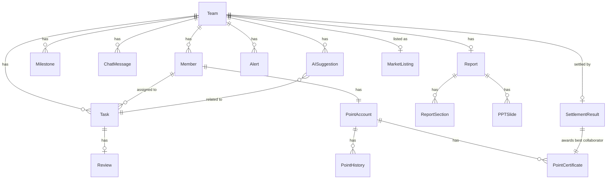

